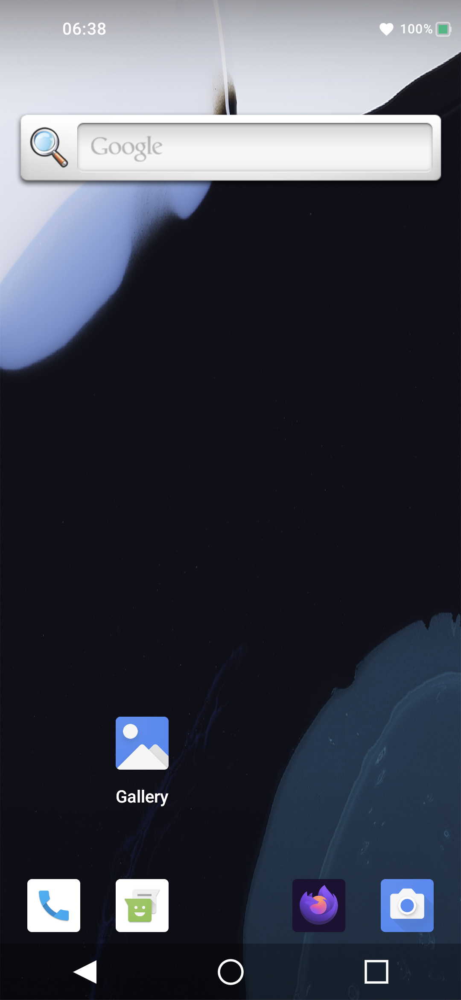
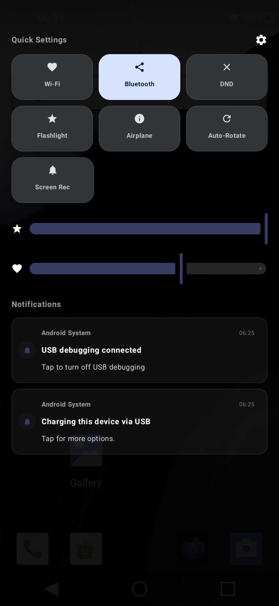

# SystemUI-Lite

A custom Android SystemUI replacement built with Kotlin and Jetpack Compose. Replaces the standard status bar, notification shade, navigation bar, and wallpaper service on rooted AOSP devices.

## Features

- **Status Bar** — system icons (WiFi, Bluetooth, DND, Airplane), battery indicator, clock with configurable position and battery style, display cutout awareness
- **Notification Shade** — real notifications via `NotificationListenerService`, Quick Settings tile grid, brightness/media volume sliders, media playback widget, dismiss/clear-all with `PendingIntent` click-through
- **Navigation Bar** — 3-button mode (back/home/recents) and gesture navigation pill, key event injection
- **Wallpaper Service** — built-in `ImageWallpaper` engine rendering the system wallpaper
- **System State** — reactive `StateFlow`-based monitoring of battery, connectivity, brightness, volume, and 10+ other system states
- **AOSP-Compatible IPC** — `CommandQueue` implementing `IStatusBar.Stub` to bridge with `system_server` via hidden APIs (`framework-minus-apex.jar`)
- **Plugin Framework** — extensible plugin system for status bar and quick settings customization
- **DI with Koin** — singleton providers for notifications, system state, and wallpaper shared across all UI surfaces

## Screenshots

<div align="center">
  
  
</div>

## Architecture

```
SystemUIService (entry point, bound by system_server)
  └── SystemUIApplication.startServicesIfNeeded()
        ├── ShadeCoreStartable       → NotificationShade (TYPE_STATUS_BAR_SUB_PANEL)
        ├── StatusBarCoreStartable   → StatusBar (TYPE_STATUS_BAR)
        ├── NavigationBarCoreStartable → NavigationBarView (TYPE_NAVIGATION_BAR)
        └── SystemNotificationListenerService → real notification capture
```

Each CoreStartable is a self-contained component with `start()`/`stop()` lifecycle, creating a `ComposeView` added directly to `WindowManager` via privileged window types. All components share reactive state through Koin singletons.

## Requirements

- **Rooted device** with `adb root` access and writable system partition
- **Platform signing** — the APK must be signed with the device's platform key
- Android 10+ (API 29+), target API 36

## Quick Start

```bash
# Build and install to device
./install.sh

# Build clean, install, and restart SystemUI
./install.sh clean

# Check SystemUI status on device
./install.sh status

# View real-time logs
./install.sh logs
```

The install script pushes `SystemUI.apk` to `/system/priv-app/SystemUI/SystemUI.apk`, replacing the stock SystemUI. A reboot or `adb shell am force-stop` triggers the new instance.

## Dependencies

- **Kotlin / Coroutines** — reactive data flow with `StateFlow`
- **Jetpack Compose** — Material 3 UI for all system bars and shade
- **Koin** — lightweight dependency injection
- **framework-minus-apex.jar** (compileOnly) — hidden/internal Android API access for direct IPC with `system_server`. Compiled from **AOSP `android-14.0.0_r28`** (Build `UP1A.231105.001.B2`, Android 14 Release 28)
- **AndroidX** — Core KTX, Lifecycle, Activity Compose

## Key Design Decisions

| Decision | Rationale |
|----------|-----------|
| `com.android.systemui` package | Matches AOSP so `system_server` binds to the service |
| `CoreStartable` pattern | Mirrors AOSP's modular component lifecycle |
| `StateFlow` over LiveData | Reactive, coroutine-native, composes well with Jetpack Compose |
| `WindowHost` bridge | Provides Lifecycle/ViewModel ownership to window-level ComposeViews |
| Direct API calls via `framework-minus-apex.jar` | Eliminates reflection for hidden API access |
| `sharedUserId="android.uid.systemui"` | Shares UID with system for privilege access |

## Known Issues / Roadmap

- **QS (Quick Settings)** — tile set is incomplete; missing many standard tiles and detail panel (long-press)
- **Navigation Bar** — layout and interaction not yet optimized for various screen sizes and modes
- **Gesture Navigation** — full gesture navigation not implemented; only basic 3-button mode and pill placeholder
- **Lock Screen** — no lock screen / keyguard module yet
- **Always-On Display** — not supported
- **Multi-User / Work Profile** — not handled

## License

This project is for educational and research purposes.
